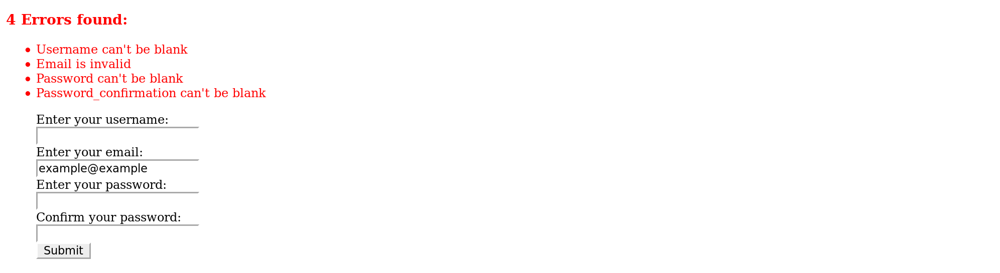

Simon Tharby's solution to [Project 1: Bare Metal Forms and Helpers](https://www.theodinproject.com/courses/ruby-on-rails/lessons/forms?ref=lnav), The Odin Project, Ruby on Rails unit, Forms and Authentication section.

As well as following the instructions, I also added a 'show' action to give a succesfull user creation somewhere a little more meaningful to go (with a link to 'create new user').

Screenshot: result of some invalid form entries for the 'create new user' action:

Users created via rails console AND web-page form input (sqlitebroswer):

